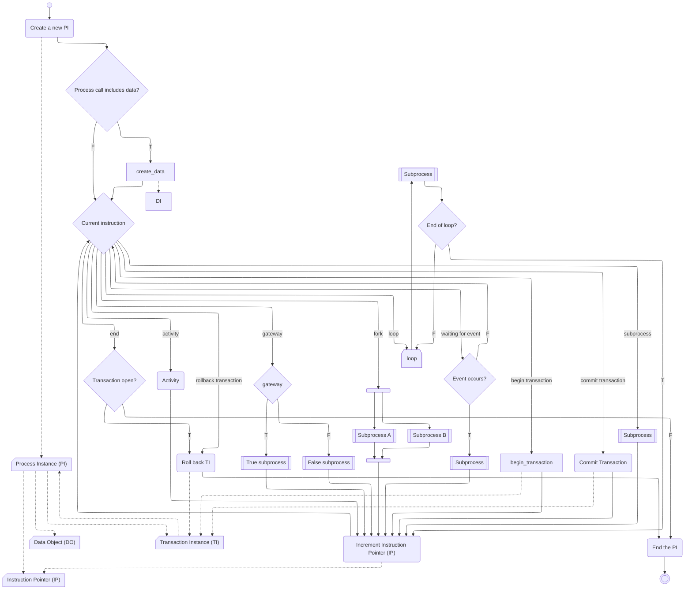

# Actions

## Primary Loop

```mermaid
---
config:
  layout: elk
---
graph TB
	PI["Process Instance (PI)"]@{shape: card}
	PI -.-> IP["Instruction Pointer (IP)"]@{shape: card}
	PI -.-> DO["Data Object (DO)"]@{shape: card}
	PI -.-> TI["Transaction Instance (TI)"]@{shape: card}

	increment("Increment Instruction Pointer (IP)") --> current_ip
	increment -.-> IP

	start(( ))
		--> PI_begin(Create a new PI)
		--> data_present{Process call includes data?}
		--F--> current_ip{Current instruction}
		--end--> TI_open{Transaction open?}
		--T--> TI_rollback(Roll back TI)
		--> PI_end(End the PI)
		--> stop((( )))
	TI_open --F--> PI_end
	PI_begin -.-> PI
	TI_rollback -.-> TI

	data_present 
		--T--> create_data
		--> current_ip
	create_data -.-> DI

	current_ip
		--activity--> activity(Activity)
		--> increment

	current_ip
		--gateway--> gateway{gateway}
		--T--> subprocess_t[[True subprocess]]
		--> increment
	gateway
		--F--> subprocess_f[[False subprocess]]
		--> increment

	current_ip
		--fork--> fork@{shape: fork}
		--> subprocess_a[[Subprocess A]]
		--> join@{shape: join}
		--> increment
	fork --> subprocess_b[[Subprocess B]]
		--> join
	
	current_ip
		--loop--> loop@{shape: loop-limit}
		--> subprocess_l[[Subprocess]]
		--> eol{End of loop?}
		--T--> increment
	eol --F--> loop

	current_ip
		--waiting for event--> event_occurs{Event occurs?}
		--T--> subprocess_e[[Subprocess]]
		--> increment
	event_occurs --F--> current_ip
	
	current_ip
		--begin transaction--> begin_transaction
		--> increment
	begin_transaction -.-> TI@{shape: card}
		-.-> PI

	current_ip
		--commit transaction--> commit_transaction(Commit Transaction)
		--> increment
	commit_transaction -.-> TI
	
	current_ip
		--rollback transaction--> TI_rollback

	current_ip
		--subprocess--> subprocess[[Subprocess]]
		--> increment
```
