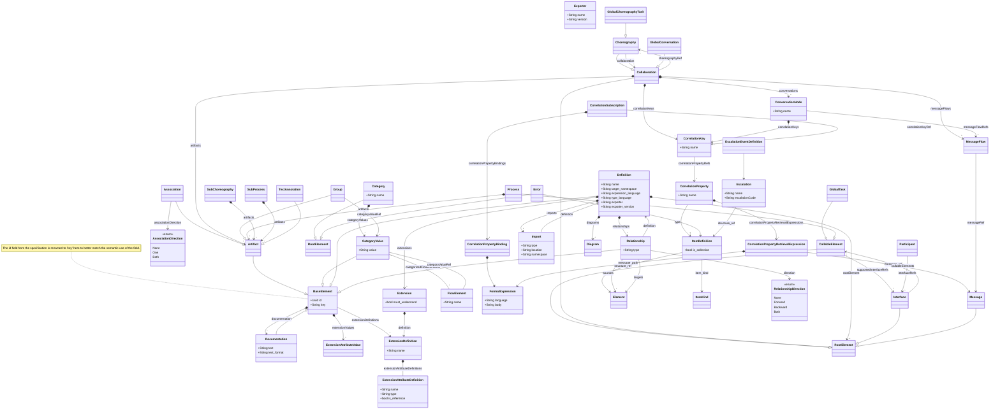

# Entities

```mermaid
classDiagram
	class Artifact
	Artifact --|> BaseElement

	class Association
	Association --|> Artifact
	Association --> AssociationDirection: associationDirection

	class AssociationDirection {
		<<enum>>
		None
		One
		Both
	}

	class BaseElement {
		+Uuid id
		+String key
	}
	BaseElement *-->"*" Documentation: documentation
	BaseElement *-->"*" ExtensionAttributeValue: extensionValues
	BaseElement -->"*" ExtensionDefinition: extensionDefinitions

	note for BaseElement "The id field from the specification is renamed to 'key' here to better match the semantic use of the field." 

	class CallableElement
	CallableElement --|> RootElement
	CallableElement -->"*" Interface: supportedInterfaceRefs

	class Category {
		+String name
	}
	Category --|> RootEleement
	Category *-->"*" CategoryValue: categoryValues

	class CategoryValue {
		+String value
	}
	CategoryValue --|> BaseElement
	CategoryValue --"*" FlowElement: categorizedFlowElements

	class Choreography
	Choreography --|> Collaboration
	Choreography -->"*" Collaboration: collaboration

	class Collaboration
	Collaboration --|> RootElement
	Collaboration -->"*" Choreography: choreographyRef
	Collaboration *-->"*" Artifact: artifacts
	Collaboration *-->"*" ConversationNode: conversations
	Collaboration *-->"*" MessageFlow: messageFlows
	Collaboration *-->"*" CorrelationKey: correlationKeys

	class ConversationNode {
		+String name
	}
	ConversationNode -->"*" MessageFlow: messageFlowRefs
	ConversationNode *-->"*" CorrelationKey: correlationKeys

	class CorrelationKey {
		+String name
	}
	CorrelationKey -->"*" CorrelationProperty: correlationPropertyRefs

	class CorrelationProperty {
		+String name
	}
	CorrelationProperty *-->"*" CorrelationPropertyRetrievalExpression: correlationPropertyRetrievalExpressions
	CorrelationProperty -->"?" ItemDefinition: type

	class CorrelationPropertyBinding
	CorrelationPropertyBinding *--> FormalExpression

	class CorrelationPropertyRetrievalExpression
	CorrelationPropertyRetrievalExpression *--> FormalExpression: message_path
	CorrelationPropertyRetrievalExpression --> Message: message_ref

	class CorrelationSubscription
	CorrelationSubscription -->CorrelationKey: correlationKeyRef
	CorrelationSubscription *-->"*" CorrelationPropertyBinding: correlationPropertyBindings

	class Definition {
		+String name
		+String target_namespace
		+String expression_language
		+String type_language
		+String exporter
		+String exporter_version
	}
	Definition --|> BaseElement
	Definition *-->"*" RootElement: rootElement
	Definition *-->"*" Import: imports
	Definition *-->"*" Relationship: relationships
	Definition *-->"*" Diagram: diagrams
	Definition *-->"*" Extension: extensions

	class Diagram

	class Documentation {
		+String text
		+String text_format
	}
	Documentation --|> BaseElement

	class Element

	class Error
	Error --|> RootEleement
	Error --> ItemDefinition: structureRef

	class Escalation {
		+String name
		+String escalationCode
	}
	Escalation --> ItemDefinition: structure_ref

	class EscalationEventDefinition
	EscalationEventDefinition --> Escalation

	class Exporter {
		+String name
		+String version
	}

	class Extension {
		+bool must_understand
	}
	Extension *--> ExtensionDefinition: definition

	class ExtensionAttributeDefinition { 
		+String name
		+String type
		+bool is_reference
	}

	class ExtensionAttributeValue

	class ExtensionDefinition {
		+String name
	}
	ExtensionDefinition *-- ExtensionAttributeDefinition: extensionAttributeDefinitions

	class FlowElement {
		+String name
	}
	FlowElement --"*" CategoryValue: categoryValueRef

	class FormalExpression {
		+String language
		+String body
	}

	class GlobalChoreographyTask
	GlobalChoreographyTask --|> Choreography

	class GlobalConversation
	GlobalConversation --|> Collaboration

	class GlobalTask
	GlobalTask --|> CallableElement

	class Group
	Group --|> Artifact
	Group -->"*" CategoryValue: categoryValueRef

	class Import {
		+String type
		+String location
		+String namespace
	}
	Import --> Definition: definition

	class Interface
	Interface --|> RootElement
	Interface -->"*" CallableElement: callableElements

	class ItemDefinition {
		+bool is_collection
	}
	ItemDefinition --> ItemKind: item_kind
	ItemDefinition --> Element: structure_ref

	class Message
	Message --|> RootElement

	class MessageFlow
	MessageFlow --> Message: messageRef

	class Participant
	Participant -->"*" Interface: interfaceRefs

	class Process
	Process --|> CallableElement
	Process *-->"*" Artifact: artifacts

	class Relationship {
		+String type
	}
	Relationship --|>BaseElement
	Relationship --> RelationshipDirection: direction
	Relationship --> Definition: definition
	Relationship -->"*" Element: sources
	Relationship -->"*" Element: targets

	class RelationshipDirection {
		<<enum>>
		None
		Forward
		Backward
		Both
	}

	class RootElement

	class SubChoreography
	SubChoreography *-->"*" Artifact: artifacts

	class SubProcess
	SubProcess *-->"*" Artifact: artifacts

	class TextAnnotation
	TextAnnotation --|> Artifact
```
